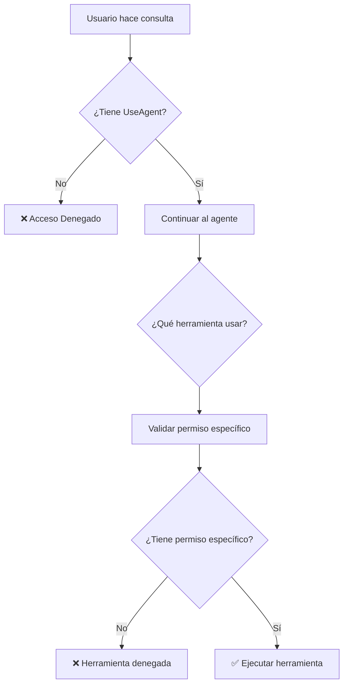

# Implementación del Permiso UseAgent - Documentación

## 📋 Resumen de Cambios

Se ha implementado una validación adicional de seguridad que requiere el permiso **`UseAgent`** para cualquier interacción con el agente médico. Este permiso es **obligatorio** y se valida antes que cualquier otro permiso específico de las herramientas.

## 🛡️ Estructura de Permisos

### Jerarquía de Permisos
```
UseAgent (OBLIGATORIO)
├── ViewPatients (para consultar información de pacientes)
└── ManagePatients (para crear/actualizar pacientes)
```

### Descripción de Permisos

1. **`UseAgent`** (NUEVO - OBLIGATORIO)
   - **Descripción**: Permiso base requerido para interactuar con el agente médico
   - **Alcance**: Se valida al inicio de cualquier consulta al agente
   - **Sin este permiso**: El usuario no puede usar el agente bajo ninguna circunstancia

2. **`ViewPatients`** (Existente)
   - **Descripción**: Permite consultar y buscar información de pacientes
   - **Herramientas**: search_patients, get_patient_by_id, get_patients_summary, etc.

3. **`ManagePatients`** (Existente)
   - **Descripción**: Permite crear y actualizar pacientes
   - **Herramientas**: create_patient, update_patient

## 🔧 Modificaciones Realizadas

### 1. Agente Médico (`app/agents/medical_agent.py`)

#### Validación en el método `query()`
```python
# MANDATORY: Check if user has UseAgent permission - this is required for ANY agent usage
has_use_agent = user_permissions and "UseAgent" in user_permissions
if not has_use_agent:
    logger.warning(f"User {username} attempted to use agent without UseAgent permission")
    return {
        "response": "❌ Acceso denegado: No tienes permisos para usar el agente médico. Se requiere el permiso 'UseAgent' para interactuar con el sistema.",
        "success": False,
        "error": "Missing UseAgent permission",
        "conversation_id": conversation_id
    }
```

#### Actualización del System Prompt
- Se agregó información sobre el requisito del permiso `UseAgent`
- Se documentó la jerarquía de permisos en las instrucciones del agente

### 2. Herramientas del Agente (`app/agents/tools.py`)

#### Nueva función de validación
```python
def check_use_agent_permission() -> tuple[bool, str]:
    """
    Check if the current user has UseAgent permission - required for ALL agent interactions.
    
    Returns:
        tuple: (has_permission, error_message_if_not)
    """
```

#### Actualización de todas las herramientas
Todas las herramientas (`@tool`) ahora incluyen:

1. **Validación de UseAgent** (primera validación)
```python
# Check UseAgent permission (mandatory for all agent tools)
has_use_agent, error_msg = check_use_agent_permission()
if not has_use_agent:
    return error_msg
```

2. **Validación de permisos específicos** (segunda validación)
```python
# Check specific permission (ViewPatients/ManagePatients)
has_permission, error_msg = check_[specific]_permission()
if not has_permission:
    return error_msg
```

3. **Documentación actualizada**
```python
**Requires Permissions:** UseAgent, ViewPatients
```

### Herramientas Actualizadas

| Herramienta | Permisos Requeridos |
|-------------|-------------------|
| `search_patients` | UseAgent + ViewPatients |
| `get_patient_by_id` | UseAgent + ViewPatients |
| `get_patients_summary` | UseAgent + ViewPatients |
| `search_patients_by_name` | UseAgent + ViewPatients |
| `filter_patients_by_demographics` | UseAgent + ViewPatients |
| `search_patients_by_condition` | UseAgent + ViewPatients |
| `create_patient` | UseAgent + ManagePatients |
| `update_patient` | UseAgent + ManagePatients |

## 🧪 Pruebas

Se creó un script de pruebas (`test_use_agent_permission.py`) que valida:

1. ❌ Usuario sin permiso `UseAgent`
2. ❌ Usuario con `UseAgent` pero sin `ViewPatients`
3. ✅ Usuario con `UseAgent` y `ViewPatients`
4. ✅ Usuario con todos los permisos
5. ❌ Usuario sin ningún permiso

### Ejecutar las pruebas
```bash
python test_use_agent_permission.py
```

## 🔐 Flujo de Validación



## 📝 Mensajes de Error

### Sin permiso UseAgent
```
❌ Acceso denegado: No tienes permisos para usar el agente médico. 
Se requiere el permiso 'UseAgent' para interactuar con el sistema.
```

### Sin permisos específicos (para herramientas)
```
🚫 **Acceso Denegado al Agente Médico**

El usuario 'username' no tiene permisos para usar el agente médico.

**Permisos actuales:** [lista de permisos]
**Permiso requerido:** UseAgent (obligatorio para cualquier interacción con el agente)

Por favor, contacte al administrador del sistema para obtener el permiso 'UseAgent'.
```

## 🎯 Beneficios de la Implementación

1. **Seguridad Mejorada**: Control granular sobre quién puede usar el agente
2. **Doble Validación**: Permiso base + permisos específicos por herramienta
3. **Logging de Seguridad**: Se registran intentos de acceso no autorizado
4. **Mensajes Claros**: Errores descriptivos para facilitar la resolución
5. **Compatibilidad**: No afecta el funcionamiento existente para usuarios autorizados

## 🚀 Siguiente Pasos

1. Actualizar la documentación de la API para incluir el nuevo permiso
2. Modificar los sistemas de autenticación/autorización para incluir `UseAgent`
3. Comunicar a los administradores sobre el nuevo permiso requerido
4. Actualizar los perfiles de usuario existentes según sea necesario

## ⚠️ Consideraciones Importantes

- **Compatibilidad hacia atrás**: Los usuarios existentes necesitarán el permiso `UseAgent` agregado a sus perfiles
- **Administración**: Los administradores deben asignar `UseAgent` a todos los usuarios que necesiten acceso al agente
- **Monitoreo**: Se recomienda monitorear los logs para identificar usuarios que necesiten el nuevo permiso
